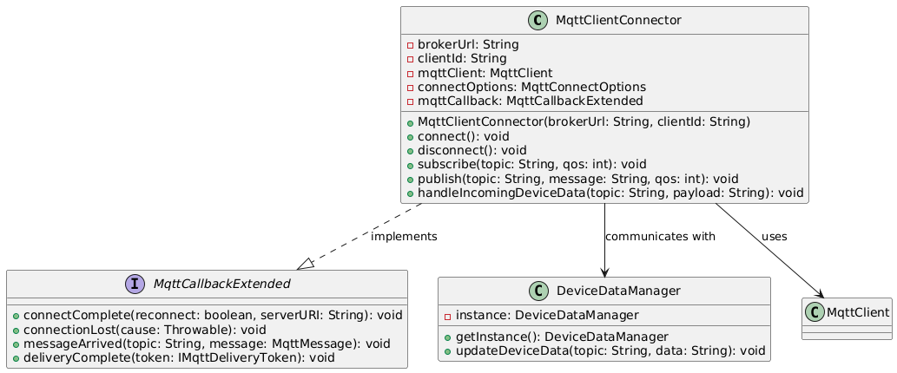

# Gateway Device Application (Connected Devices)

## Lab Module 07

Be sure to implement all the PIOT-GDA-* issues (requirements) listed at [PIOT-INF-07-001 - Lab Module 07](https://github.com/orgs/programming-the-iot/projects/1#column-10488499).

### Description

NOTE: Include two full paragraphs describing your implementation approach by answering the questions listed below.

What does your implementation do? 
The MqttClientConnector class manages MQTT communication by handling connection, message publishing, and subscription.
The MqttCallbackExtended handles the connection events and incoming messages, which can then be passed to DeviceDataManager for further processing.
The DeviceDataManager is a singleton that updates the system state based on the received MQTT data.
This structure allows for easy integration and flexibility for further expansions, like adding error handling, retries, or more complex MQTT QoS configurations.
How does your implementation work?
The implementation provides a clean, flexible way to work with MQTT in a Java application, supporting both basic communication with the broker and seamless integration with other system components (like DeviceDataManager).
Callback-based architecture: The MQTT client uses callbacks (MqttCallbackExtended) to handle events like successful connection, lost connection, and incoming messages, which allows for asynchronous message handling.
Publish/Subscribe mechanism: The publish() and subscribe() methods allow the client to communicate with the broker by sending messages or receiving data from specific topics.
Integration with DeviceDataManager: When an MQTT message is received, it can be forwarded to DeviceDataManager for further processing, making it easy to handle device-related data and actions within your system.

### Code Repository and Branch

NOTE: Be sure to include the branch (e.g. https://github.com/programming-the-iot/python-components/tree/alpha001).

URL: https://github.com/Francistapiwa/Java-components/tree/lab07

### UML Design Diagram(s)

NOTE: Include one or more UML designs representing your solution. It's expected each
diagram you provide will look similar to, but not the same as, its counterpart in the
book [Programming the IoT](https://learning.oreilly.com/library/view/programming-the-internet/9781492081401/).

### Unit Tests Executed

NOTE: TA's will execute your unit tests. You only need to list each test case below
(e.g. ConfigUtilTest, DataUtilTest, etc). Be sure to include all previous tests, too,
since you need to ensure you haven't introduced regressions.

- ActuatorDataTest
- SensorDataTest
- SystemPerformanceDataTest
- SystemStateDataTest
- DataUtilTest
- 

### Integration Tests Executed

NOTE: TA's will execute most of your integration tests using their own environment, with
some exceptions (such as your cloud connectivity tests). In such cases, they'll review
your code to ensure it's correct. As for the tests you execute, you only need to list each
test case below (e.g. SensorSimAdapterManagerTest, DeviceDataManagerTest, etc.)

- MqttClientConnectorTest
- SystemPerformanceManagerTest.
- DataIntegrationTest
- DeviceDataManagerNoCommsTest

EOF.
