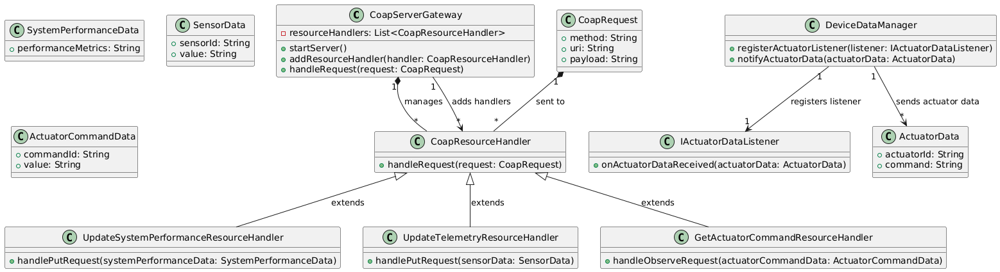

# Constrained Device Application (Connected Devices)

## Lab Module 09

Be sure to implement all the PIOT-CDA-* issues (requirements) listed at [PIOT-INF-09-001 - Lab Module 09](https://github.com/orgs/programming-the-iot/projects/1#column-10488503).

### Description

NOTE: Include two full paragraphs describing your implementation approach by answering the questions listed below.

What does your implementation do? 
The implementation works by setting up a CoAP server using the Californium-core and Scandium-core libraries to enable communication between IoT devices and services. The main class, CoapServerGateway, manages the server, hosts resources, and processes CoAP requests. It can dynamically add resource handlers, which handle specific CoAP methods (e.g., GET, PUT).

Three resource handler classes are implemented:

UpdateSystemPerformanceResourceHandler: Handles PUT requests to update system performance data.
UpdateTelemetryResourceHandler: Handles PUT requests to update sensor telemetry data.
GetActuatorCommandResourceHandler: Handles CoAP OBSERVE requests to receive actuation commands.
These handlers are based on a template class, GenericCoapResourceHandler, simplifying the creation of new handlers for different data types. The CoapServerGateway integrates with the DeviceDataManager, which is responsible for managing devices and their data.

The DeviceDataManager supports the registration of an IActuatorDataListener, which listens for actuator data events. The server can either create resource handlers internally or receive them from the DeviceDataManager.

This setup allows efficient, asynchronous communication in an IoT system, where devices can send updates, telemetry, and actuation commands using the CoAP protocol. The CoapServerGateway serves as a central hub for managing resources, while the DeviceDataManager manages the external data interactions.

How does your implementation work?

The implementation sets up a CoAP server using Californium-core and Scandium-core libraries to facilitate communication for IoT devices. At the core is the CoapServerGateway class, which acts as the CoAP server, manages resource handlers, and processes incoming CoAP requests (like PUT, GET, and OBSERVE).

The server can dynamically add resource handlers for different types of requests:

UpdateSystemPerformanceResourceHandler: Handles updates for system performance data.
UpdateTelemetryResourceHandler: Handles updates for sensor data (telemetry).
GetActuatorCommandResourceHandler: Handles CoAP OBSERVE requests for receiving actuation commands.
These handlers extend a base class, CoapResourceHandler, simplifying the creation of new handlers for different data types. The server processes requests by forwarding them to the correct handler based on the request method.

The DeviceDataManager is responsible for managing devices and their data. It can register an IActuatorDataListener, which listens for changes in actuator data and responds accordingly.

When a CoAP request is received, the server processes it and updates or retrieves data as needed, such as system performance, sensor readings, or actuator commands. The CoAP protocol allows for lightweight, asynchronous communication between devices.

Overall, the system enables scalable, event-driven communication in IoT environments, allowing devices to send and receive updates or actuation commands efficiently. The architecture is flexible and can support dynamic integration of new resource handlers and device interactions.
### Code Repository and Branch

NOTE: Be sure to include the branch (e.g. https://github.com/programming-the-iot/python-components/tree/alpha001).

URL: 

### UML Design Diagram(s)

NOTE: Include one or more UML designs representing your solution. It's expected each
diagram you provide will look similar to, but not the same as, its counterpart in the
book

### Unit Tests Executed

NOTE: TA's will execute your unit tests. You only need to list each test case below
(e.g. ConfigUtilTest, DataUtilTest, etc). Be sure to include all previous tests, too,
since you need to ensure you haven't introduced regressions.

- ConfigUtilTest
- SystemCpuUtilTaskTest.
- SystemMemUtilTaskTest
- ActuatorDataTest
- SensorDataTest
- SystemPerformanceDataTest
- HumidifierActuatorSimTaskTest
- HvacActuatorSimTaskTest
- 
- 

### Integration Tests Executed

NOTE: TA's will execute most of your integration tests using their own environment, with
some exceptions (such as your cloud connectivity tests). In such cases, they'll review
your code to ensure it's correct. As for the tests you execute, you only need to list each
test case below (e.g. SensorSimAdapterManagerTest, DeviceDataManagerTest, etc.)

-  ConstrainedDeviceAppTest
- SystemPerformanceManagerTest
- SensorAdapterManagerTest
- SensorAdapterManagerTest
- HumidityEmulatorTaskTest
- PressureEmulatorTaskTest
- TemperatureEmulatorTaskTest
- SenseHatEmulatorQuickTest
- EmbeddedSensorAdapterTest
- MqttClientConnectorTest
- CoapClientToServerConnectorTest

- 
- 

EOF.
