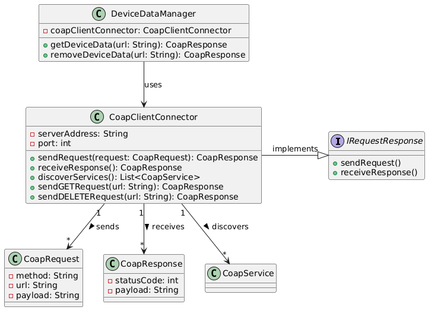

# Constrained Device Application (Connected Devices)

## Lab Module 09

Be sure to implement all the PIOT-CDA-* issues (requirements) listed at [PIOT-INF-09-001 - Lab Module 09](https://github.com/orgs/programming-the-iot/projects/1#column-10488503).

### Description

NOTE: Include two full paragraphs describing your implementation approach by answering the questions listed below.

What does your implementation do? 
The implementation focuses on creating a CoapClientConnector Java class that will interact with CoAP servers using the Californium CoAP library. This class will implement the IRequestResponse interface, handling multiple types of CoAP requests such as GET, DELETE, and discovery.

Core Features of the Implementation:
CoapClientConnector Class:

This class serves as the client-side connector for communicating with a CoAP server.
Implements the IRequestResponse interface, which defines methods for sending and receiving CoAP requests and responses.
IRequestResponse Interface:

The interface provides the structure for handling CoAP request types like GET and DELETE.
The CoapClientConnector will implement these methods to send requests and process server responses.
Discovery Functionality:

The CoapClientConnector will support a discovery feature, enabling it to search for available CoAP servers or resources in a network.
This is achieved by sending a DISCOVER message to identify active CoAP servers or resources.
GET Requests:

The class will be capable of sending GET requests to retrieve data from a CoAP server, such as resources or sensor data.
It will utilize the existing methods within IRequestResponseHandler for handling GET requests and processing the server's response.
DELETE Requests:

DELETE requests will allow the CoapClientConnector to remove resources from a CoAP server.
It will use the IRequestResponseHandler interface to send DELETE requests and manage the server’s response.
CoAP Protocol:

CoAP is a lightweight protocol for constrained devices, ideal for Internet of Things (IoT) applications.
The system leverages CoAP’s efficiency for communication in resource-constrained environments, making it well-suited for low-power IoT devices.
Integration with DeviceDataManager:

The CoapClientConnector will be integrated with DeviceDataManager or other systems that require communication with CoAP-enabled devices.
It facilitates communication between the client application and CoAP servers, enabling resource retrieval (via GET) and deletion (via DELETE).
Middleware Role:

The CoapClientConnector acts as middleware, managing the request-response interaction between the CoAP server and the larger system.
It handles the underlying CoAP communication, simplifying interaction with the server for other components.

How does your implementation work?

CoapClientConnector Class:

The class is the main entry point for handling CoAP communication from the client side.
It connects to CoAP servers and manages the request-response cycle by sending various types of CoAP requests (GET, DELETE).
IRequestResponse Interface:

The CoapClientConnector implements the IRequestResponse interface, which defines methods for sending requests and receiving responses.
These methods allow the client to send GET requests to retrieve resources and DELETE requests to remove resources from a CoAP server.
Discovery Functionality:

The discovery feature enables the CoapClientConnector to send DISCOVER messages, searching for available CoAP servers and resources on the network.
This allows the client to dynamically find services or devices in the network that support CoAP.
GET Requests:

The CoapClientConnector sends GET requests to retrieve data from CoAP servers, such as sensor data or other resources.
The implementation makes use of the IRequestResponseHandler to manage the sending of GET requests and the processing of the server’s response.
DELETE Requests:

The class also supports DELETE requests, allowing resources to be removed from the CoAP server.
Like GET, DELETE requests are handled through the IRequestResponseHandler methods, sending the request and receiving a confirmation response.
Integration with DeviceDataManager:

The CoapClientConnector class integrates with systems like DeviceDataManager, enabling communication with IoT devices over the CoAP protocol.
This allows the client to interact with devices, manage resource retrieval and deletion, and facilitate data management tasks.
Middleware Role:

Acting as middleware, the CoapClientConnector handles the communication logic, simplifying the process for other components like DeviceDataManager to interact with CoAP-enabled devices.
In summary, the CoapClientConnector class manages the client’s interaction with CoAP servers, supporting GET, DELETE, and discovery functionalities. It implements the IRequestResponse interface to send and receive requests, while integrating with other system components to facilitate efficient communication and data management in IoT environments.
### Code Repository and Branch

NOTE: Be sure to include the branch (e.g. https://github.com/programming-the-iot/python-components/tree/alpha001).

URL: 

### UML Design Diagram(s)

NOTE: Include one or more UML designs representing your solution. It's expected each
diagram you provide will look similar to, but not the same as, its counterpart in the
book [Programming the IoT](https://learning.oreilly.com/library/view/programming-the-internet/9781492081401/).

### Unit Tests Executed

NOTE: TA's will execute your unit tests. You only need to list each test case below
(e.g. ConfigUtilTest, DataUtilTest, etc). Be sure to include all previous tests, too,
since you need to ensure you haven't introduced regressions.

-  ConfigUtilTest
- GatewayDeviceAppTest
- SystemPerformanceManagerTest
- SystemCpuUtilTaskTest
- ActuatorDataTest
- SensorDataTest
- SystemPerformanceDataTest
- SystemMemUtilTaskTest
- SystemStateDataTest
- DataUtilTest
- 

### Integration Tests Executed

NOTE: TA's will execute most of your integration tests using their own environment, with
some exceptions (such as your cloud connectivity tests). In such cases, they'll review
your code to ensure it's correct. As for the tests you execute, you only need to list each
test case below (e.g. SensorSimAdapterManagerTest, DeviceDataManagerTest, etc.)

- GatewayDeviceAppTest
- DataIntegrationTest
- DeviceDataManagerNoCommsTest
- MqttClientConnectorTest
- CoapClientToServerConnectorTest
- CloudClientConnectorTest
 

EOF.
